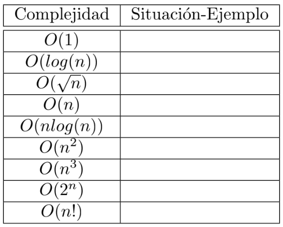

# LAB 04: Análisis Asintótico

##  Competencia del Curso
El alumno comprenderá e identificará el uso adecuado de diferentes algoritmos para dar solución a problemas de manera eficiente
teniendo en consideración el tiempo de procesamiento y la cantidad de recursos empleados.

## Competencia del Laboratorio
El alumno deberá de analizar y comprender las diferentes técnicas de diseño de Algoritmos
## Equipos y Materiales
• Un computador.
• Compilador del lenguaje C++

### 0.1 Análisis Asintótico
Describir en que situaciones se puede presentar los siguiente complejidades de los algoritmos, incluya un ejemplo de un problema:

  
  

### 0.2 Análisis de Algoritmos

Detalle el tiempo de ejecución linea a linea y total de los siguientes algoritmos: (Utilice Notación-O). (Capítulo 3 de [1]). En el caso de encontrar llamadas a funciones del cual no se encuentra la referencia de código, asumir un tiempo O(1).

  
  

👉🏽 **Tarea** 👈🏽 Tómate el tiempo para revisar los archivos. Deberían compilarse sin modificaciones en este punto. 
